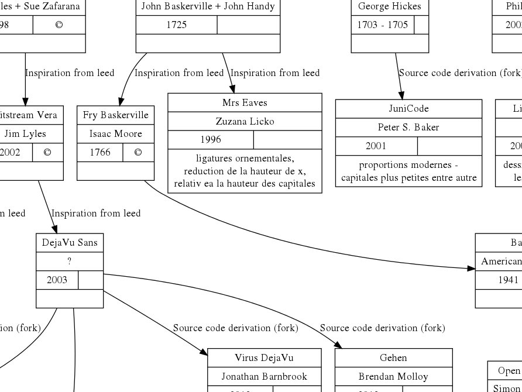

# Type Derivation

Tentative de représentation cartographique des dérivations de caractères typographiques sous licence libre. Projet réalisé dans le cadre du cours de typographie de @raphaelbastide à l'[ESADHaR](http://www.esadhar.fr).

## Outils

La carte a été réalisé avec [GraphViz](http://graphviz.org/).

## Usage

Lancer un serveur web, node ou apache (mamp, wamp…) puis accéder à `index.html` via `localhost` dans le navigateur.

## Collaboration

Ce projet est non exhaustif et ouvert aux collaborations.

# Merci

Conversion Graphviz à HTML et SVG rendue possible gràce à [Viz](https://github.com/mdaines/viz.js)
